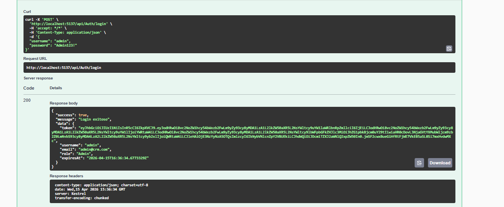
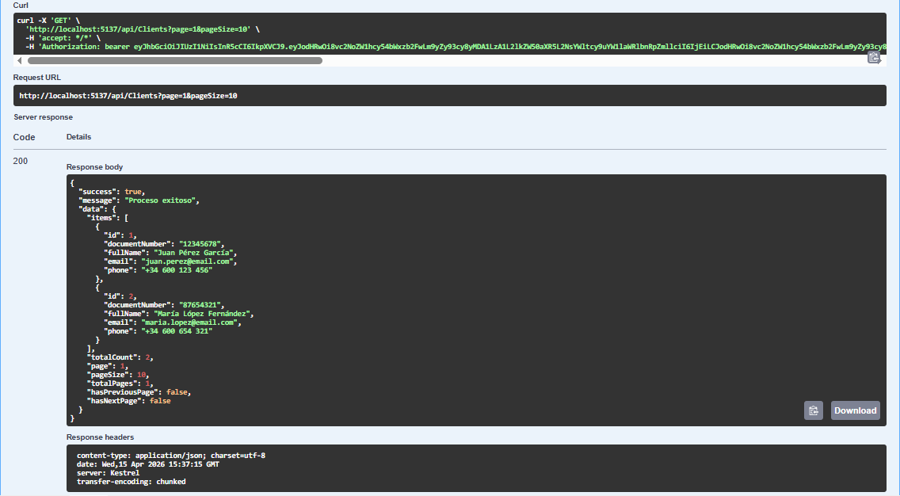
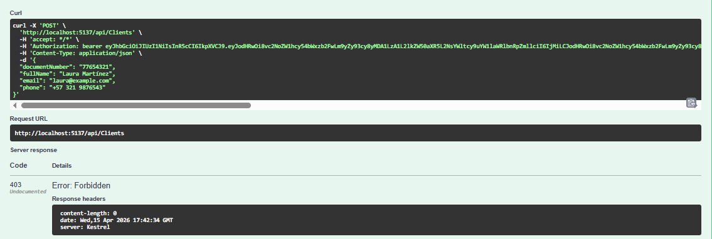

# 🚀 Microservicio CRM - Sistema de Gestión de Clientes

## 📋 Descripción General

Microservicio CRM completo y **production-ready** desarrollado en **.NET 8 (LTS)** (C#) que proporciona gestión integral de clientes, contactos, notas y oportunidades de venta. Implementa características empresariales avanzadas como auditoría automática, soft delete, autenticación JWT con roles, y arquitectura en capas siguiendo principios SOLID.

---

## ✨ Características Principales

### 🔐 Seguridad y Autenticación
- **Autenticación JWT (JSON Web Tokens)** con firma HMAC-SHA256
- **Sistema de roles** con control de acceso granular:
  - **Admin**: CRUD completo en todas las entidades
  - **Asesor**: Read + Create en clientes/contactos/oportunidades, CRUD completo en notas
  - **Auditor**: Solo Read (lectura) en todas las entidades
- **Contraseñas hasheadas** con BCrypt (factor de trabajo 12)
- **Claims personalizados** en JWT: UserId, Username, Email, Role

### 📊 Auditoría Automática
Sistema de auditoría completo implementado a nivel de DbContext que registra automáticamente:
- **CreatedBy**: Usuario que creó el registro (obtenido del JWT token)
- **CreatedAt**: Timestamp UTC de creación
- **UpdatedBy**: Usuario que modificó el registro
- **UpdatedAt**: Timestamp UTC de última modificación
- **DeletedBy**: Usuario que eliminó el registro (soft delete)
- **DeletedAt**: Timestamp UTC de eliminación

### 🗑️ Soft Delete (Borrado Lógico)
- Los registros **NO se eliminan físicamente** de la base de datos
- Se marcan con `IsDeleted = true`
- **Filtros globales** en EF Core excluyen automáticamente registros eliminados
- Permite auditorías posteriores y recuperación de datos
- Mantiene integridad referencial completa

### 🏗️ Arquitectura en Capas
Separación clara de responsabilidades siguiendo **Clean Architecture**:
1. **Presentation Layer**: Controllers (HTTP/REST API)
2. **Business Logic Layer**: Services (lógica de negocio, validaciones)
3. **Data Access Layer**: Repositories (persistencia, queries)
4. **Domain Layer**: Entities (modelos de dominio)

### 🔄 Patrón Repository
- Abstracción de EF Core en capa de repositorios
- Facilita testing con mocks
- Permite cambiar ORM sin afectar lógica de negocio
- Operaciones CRUD encapsuladas y reutilizables

### 🗺️ AutoMapper
- Mapeo automático entre DTOs y Entidades
- Separación entre modelos de API y dominio
- Configuración centralizada en `MappingProfile.cs`

### 📝 Logging Estructurado
- **ILogger<T>** con structured logging
- Parámetros con nombres: `{ClientId}`, `{DocumentNumber}`, etc.
- Facilita búsquedas en sistemas de logging (ELK, Splunk, Application Insights)
- Niveles: Information, Warning, Error

### 🗄️ Base de Datos SQLite
- **No requiere instalación** de SQL Server
- Base de datos local en archivo `crm.db`
- Ideal para desarrollo y demos
- Fácil migración a SQL Server/PostgreSQL para producción

### 📄 Paginación
- Soporte de paginación en listados
- Parámetros: `page` (número de página), `pageSize` (tamaño de página)
- Metadata incluida: `TotalCount`, `Page`, `PageSize`
- Optimización de queries grandes

### 🔍 Filtros Dinámicos
- Búsqueda por múltiples criterios
- Filtros opcionales en endpoints
- Búsqueda parcial con `LIKE` (ej: `%Acme%`)

---

## 🏛️ Arquitectura del Sistema

```
┌─────────────────────────────────────────────────────────────────┐
│                        CLIENTE HTTP                              │
│                  (Postman, Angular, React)                       │
└────────────────────────────┬────────────────────────────────────┘
                             │
                             │ HTTP Request (JSON)
                             ↓
┌─────────────────────────────────────────────────────────────────┐
│                    PRESENTATION LAYER                            │
│                                                                  │
│  ┌──────────────┐  ┌──────────────┐  ┌──────────────┐         │
│  │   Clients    │  │     Auth     │  │  Contacts    │         │
│  │  Controller  │  │  Controller  │  │  Controller  │  ...    │
│  └──────────────┘  └──────────────┘  └──────────────┘         │
│         │                  │                  │                 │
│         │ - Validación HTTP                   │                 │
│         │ - Model Binding                     │                 │
│         │ - Autorización ([Authorize])        │                 │
│         │ - Retorna ApiResponse               │                 │
└─────────┴──────────────────┴──────────────────┴─────────────────┘
                             │
                             ↓
┌─────────────────────────────────────────────────────────────────┐
│                   BUSINESS LOGIC LAYER                           │
│                                                                  │
│  ┌──────────────┐  ┌──────────────┐  ┌──────────────┐         │
│  │   Client     │  │     Auth     │  │  Contact     │         │
│  │   Service    │  │   Service    │  │   Service    │  ...    │
│  └──────────────┘  └──────────────┘  └──────────────┘         │
│         │                  │                  │                 │
│         │ - Validaciones de Negocio           │                 │
│         │ - Orquestación                      │                 │
│         │ - Mapeo DTO ↔ Entity (AutoMapper)  │                 │
│         │ - Logging Estructurado              │                 │
└─────────┴──────────────────┴──────────────────┴─────────────────┘
                             │
                             ↓
┌─────────────────────────────────────────────────────────────────┐
│                   DATA ACCESS LAYER                              │
│                                                                  │
│  ┌──────────────┐  ┌──────────────┐  ┌──────────────┐         │
│  │   Client     │  │   Contact    │  │     Note     │         │
│  │  Repository  │  │  Repository  │  │  Repository  │  ...    │
│  └──────────────┘  └──────────────┘  └──────────────┘         │
│         │                  │                  │                 │
│         │ - Queries EF Core                   │                 │
│         │ - AsNoTracking() para lectura       │                 │
│         │ - Change Tracking                   │                 │
└─────────┴──────────────────┴──────────────────┴─────────────────┘
                             │
                             ↓
┌─────────────────────────────────────────────────────────────────┐
│                       AppDbContext                               │
│                   (Entity Framework Core)                        │
│                                                                  │
│  - Intercepta SaveChangesAsync()                                │
│  - Auditoría Automática (CreatedBy, UpdatedBy, DeletedBy)      │
│  - Soft Delete (IsDeleted = true)                              │
│  - Filtros Globales (WHERE IsDeleted = 0)                      │
│  - Configuración de Entidades                                  │
└─────────────────────────────┬───────────────────────────────────┘
                             │
                             ↓
┌─────────────────────────────────────────────────────────────────┐
│                      SQLite Database                             │
│                      (Archivo: crm.db)                           │
│                                                                  │
│  Tablas:                                                         │
│  - Users (Usuarios del sistema)                                 │
│  - Clients (Clientes)                                           │
│  - Contacts (Contactos de clientes)                             │
│  - ClientNotes (Notas de clientes)                              │
│  - Opportunities (Oportunidades de venta)                       │
└─────────────────────────────────────────────────────────────────┘
```

---

## 📁 Estructura del Proyecto

```
CrmService/
│
├── 📂 Controllers/                # Presentation Layer (API REST)
│   ├── AuthController.cs         # POST /api/auth/register, /login
│   ├── ClientsController.cs      # CRUD clientes
│   ├── ContactsController.cs     # CRUD contactos
│   ├── NotesController.cs        # Crear notas
│   └── OpportunitiesController.cs # Crear oportunidades
│
├── 📂 Services/                   # Business Logic Layer
│   ├── IAuthService.cs           # Interfaz autenticación
│   ├── AuthService.cs            # Lógica: Register, Login, GenerateToken
│   ├── IClientService.cs         # Interfaz clientes
│   ├── ClientService.cs          # Lógica: validaciones, mapeo, orquestación
│   ├── IContactService.cs
│   ├── ContactService.cs
│   ├── INoteService.cs
│   ├── NoteService.cs
│   ├── IOpportunityService.cs
│   └── OpportunityService.cs
│
├── 📂 Repositories/               # Data Access Layer
│   ├── IClientRepository.cs      # Interfaz repositorio clientes
│   ├── ClientRepository.cs       # Queries EF Core: GetAll, GetById, Create, Update, Delete
│   ├── IContactRepository.cs
│   ├── ContactRepository.cs
│   ├── INoteRepository.cs
│   ├── NoteRepository.cs
│   ├── IOpportunityRepository.cs
│   └── OpportunityRepository.cs
│
├── 📂 Domain/                     # Domain Layer (Entidades de Negocio)
│   ├── BaseEntity.cs             # Clase base: Id, CreatedBy, UpdatedBy, IsDeleted, etc.
│   ├── User.cs                   # Usuario del sistema (login)
│   ├── UserRole.cs               # Enum: Admin, Asesor, Auditor
│   ├── Client.cs                 # Cliente (1:N con Contacts, Notes, Opportunities)
│   ├── Contact.cs                # Contacto de cliente
│   ├── ClientNote.cs             # Nota de cliente
│   └── Opportunity.cs            # Oportunidad de venta
│
├── 📂 Data/                       # Configuración de EF Core
│   └── AppDbContext.cs           # DbContext con auditoría automática y soft delete
│
├── 📂 DTOs/                       # Data Transfer Objects (API)
│   ├── LoginDto.cs               # Request: Login
│   ├── RegisterDto.cs            # Request: Register
│   ├── AuthResponseDto.cs        # Response: JWT token
│   ├── ClientDto.cs              # Response: Cliente
│   ├── CreateClientDto.cs        # Request: Crear/Actualizar cliente
│   ├── ClientFilterDto.cs        # Request: Filtros búsqueda clientes
│   ├── ContactDto.cs
│   ├── CreateContactDto.cs
│   ├── NoteDto.cs
│   ├── CreateNoteDto.cs
│   ├── OpportunityDto.cs
│   └── CreateOpportunityDto.cs
│
├── 📂 Mappings/                   # Configuración AutoMapper
│   └── MappingProfile.cs         # Mapeos DTO ↔ Entity
│
├── 📂 Common/                     # Clases Comunes
│   ├── ApiResponse.cs            # Respuesta estándar HTTP
│   ├── PagedResult.cs            # Resultado paginado
│   └── PaginationParams.cs       # Parámetros paginación
│
├── 📂 Middleware/                 # Middlewares personalizados
│   └── ErrorHandlingMiddleware.cs # Manejo global de excepciones
│
├── Program.cs                     # Configuración y punto de entrada
├── appsettings.json              # Configuración: JWT, ConnectionString, Logging
├── appsettings.Development.json
├── CrmService.csproj             # Archivo del proyecto
└── crm.db                        # Base de datos SQLite (generada al ejecutar)
```

---

## 🗃️ Modelo de Datos

### Diagrama de Entidades

```
┌─────────────────────────────────────────────────┐
│                    Users                         │
├─────────────────────────────────────────────────┤
│ Id (PK)              int                         │
│ Username             string (unique)             │
│ Email                string (unique)             │
│ PasswordHash         string (BCrypt)             │
│ Role                 UserRole (enum)             │
│ CreatedAt            DateTime                    │
│ CreatedBy            string?                     │
│ UpdatedAt            DateTime?                   │
│ UpdatedBy            string?                     │
│ IsDeleted            bool                        │
│ DeletedAt            DateTime?                   │
│ DeletedBy            string?                     │
└─────────────────────────────────────────────────┘
                         │
                         │ (Autenticación)
                         ↓
┌─────────────────────────────────────────────────┐
│                   Clients                        │
├─────────────────────────────────────────────────┤
│ Id (PK)              int                         │
│ Name                 string (max 200)            │
│ DocumentNumber       string (max 50, unique)     │
│ Email                string (max 100)            │
│ Phone                string? (max 20)            │
│ Address              string? (max 500)           │
│ CreatedAt            DateTime                    │
│ CreatedBy            string?                     │
│ UpdatedAt            DateTime?                   │
│ UpdatedBy            string?                     │
│ IsDeleted            bool                        │
│ DeletedAt            DateTime?                   │
│ DeletedBy            string?                     │
└─────────────────────────────────────────────────┘
              │                │              │
              │                │              │
    ┌─────────┘       ┌────────┘              └────────┐
    │                 │                                 │
    ↓                 ↓                                 ↓
┌──────────────┐  ┌──────────────┐         ┌─────────────────┐
│  Contacts    │  │ ClientNotes  │         │  Opportunities  │
├──────────────┤  ├──────────────┤         ├─────────────────┤
│ Id (PK)      │  │ Id (PK)      │         │ Id (PK)         │
│ Name         │  │ Content      │         │ Title           │
│ Email        │  │ ClientId (FK)│         │ Description     │
│ Phone        │  │ CreatedAt    │         │ Amount (decimal)│
│ Position     │  │ CreatedBy    │         │ Status (enum)   │
│ ClientId (FK)│  │ ...          │         │ ClientId (FK)   │
│ CreatedAt    │  └──────────────┘         │ CreatedAt       │
│ CreatedBy    │                            │ CreatedBy       │
│ ...          │                            │ ...             │
└──────────────┘                            └─────────────────┘
```

### Relaciones
- **Client 1:N Contacts**: Un cliente puede tener múltiples contactos
- **Client 1:N ClientNotes**: Un cliente puede tener múltiples notas
- **Client 1:N Opportunities**: Un cliente puede tener múltiples oportunidades

---

## 🛠️ Tecnologías Utilizadas

### Framework y Lenguaje
- **.NET 8 (LTS)** (C#)
- **ASP.NET Core Web API**

### ORM y Base de Datos
- **Entity Framework Core 8.0** (Code First)
- **SQLite** (desarrollo/demo)
- Soporte para **SQL Server**, **PostgreSQL** (producción)

### Paquetes NuGet Principales
```xml
<PackageReference Include="Microsoft.EntityFrameworkCore" Version="8.0.11" />
<PackageReference Include="Microsoft.EntityFrameworkCore.Sqlite" Version="8.0.11" />
<PackageReference Include="Microsoft.EntityFrameworkCore.Tools" Version="8.0.11" />
<PackageReference Include="AutoMapper.Extensions.Microsoft.DependencyInjection" Version="12.0.0" />
<PackageReference Include="BCrypt.Net-Next" Version="4.0.3" />
<PackageReference Include="Microsoft.AspNetCore.Authentication.JwtBearer" Version="8.0.11" />
<PackageReference Include="System.IdentityModel.Tokens.Jwt" Version="7.0.0" />
```

### Seguridad
- **JWT (JSON Web Tokens)**: Microsoft.AspNetCore.Authentication.JwtBearer
- **BCrypt**: BCrypt.Net-Next (hashing de contraseñas)

### Mapeo de Objetos
- **AutoMapper**: Conversión DTO ↔ Entity

### Logging
- **ILogger<T>**: Logging estructurado integrado en ASP.NET Core

---

## 📸 Capturas de Pantalla

El proyecto incluye **16 capturas de pantalla** que demuestran todas las funcionalidades del API en acción:

- ✅ Autenticación JWT y autorización por roles
- ✅ CRUD completo de clientes, contactos, notas y oportunidades
- ✅ Soft delete y auditoría automática
- ✅ Filtrado, paginación y búsquedas
- ✅ Manejo de errores (401, 403, 404)
- ✅ Validación de tokens en jwt.io

**Ver todas las capturas:** [Screenshots/README.md](Screenshots/README.md)

### Vista Previa:

| Autenticación | CRUD Clientes | Control de Permisos |
|---------------|---------------|---------------------|
|  |  |  |

*Login con JWT, listado de clientes con paginación, y error 403 cuando un Auditor intenta crear clientes*

---

## 🚀 Instalación y Configuración

### Prerrequisitos
- **.NET 8 SDK** instalado ([Descargar aquí](https://dotnet.microsoft.com/download/dotnet/8.0))
- **IDE**: Visual Studio 2022, Visual Studio Code o Rider

### Pasos de Instalación

#### 1. Clonar el repositorio
```bash
cd "C:\Users\calo-\OneDrive\Documentos\Proyecto Angular\App CRM Simple\CrmService"
```

#### 2. Restaurar paquetes NuGet
```bash
dotnet restore
```

#### 3. Configurar `appsettings.json`

El archivo `appsettings.json` ya tiene configuración por defecto. Puedes personalizarlo:

```json
{
  "ConnectionStrings": {
    "DefaultConnection": "Data Source=crm.db"
  },
  "Jwt": {
    "SecretKey": "TuClaveSecretaSuperSeguraConMasDe32Caracteres!!!",
    "Issuer": "CrmServiceAPI",
    "Audience": "CrmServiceClients",
    "ExpirationMinutes": 60
  },
  "Logging": {
    "LogLevel": {
      "Default": "Information",
      "Microsoft.AspNetCore": "Warning"
    }
  }
}
```

**IMPORTANTE**: Cambia `Jwt:SecretKey` por una clave segura en producción.

#### 4. Crear la base de datos con migraciones

El proyecto incluye **inicialización automática de base de datos** al ejecutar `dotnet run`. Si prefieres usar migraciones de EF Core manualmente:

```bash
# Instalar herramienta EF Core CLI (si no la tienes)
dotnet tool install --global dotnet-ef

# Crear migración inicial
dotnet ef migrations add InitialCreate --output-dir Data/Migrations

# Aplicar migración (crea el archivo crm.db)
dotnet ef database update
```

**📚 Para guía detallada de migraciones**, ver: [MIGRATIONS-AND-POLICIES.md](./MIGRATIONS-AND-POLICIES.md)

#### 5. Ejecutar el proyecto

```bash
dotnet run
```

**🌱 Datos Iniciales Automáticos (Seeding)**

Al iniciar el proyecto por primera vez, se crean automáticamente:

✅ **3 Usuarios de prueba**:
- **Admin**: `admin@crm.com` / `Admin123!` (acceso completo)
- **Asesor**: `asesor@crm.com` / `Asesor123!` (gestión de clientes/notas)
- **Auditor**: `auditor@crm.com` / `Auditor123!` (solo lectura)

✅ **2 Clientes de ejemplo** con contactos
✅ **3 Notas** de ejemplo
✅ **2 Oportunidades de negocio** de ejemplo

Puedes usar estas credenciales para probar la API inmediatamente. Ver la sección de [Testing con Postman](#-testing-con-postman) más abajo.

La API estará disponible en:
- **HTTP**: `http://localhost:5000`
- **HTTPS**: `https://localhost:5001`
- **Swagger**: `https://localhost:5001/swagger`

---

## 📡 Endpoints de la API

### 🔐 Autenticación

#### Registrar Usuario
```http
POST /api/auth/register
Content-Type: application/json

{
  "username": "admin",
  "email": "admin@crm.com",
  "password": "Admin123!",
  "role": "Admin"
}
```

**Respuesta**:
```json
{
  "success": true,
  "message": "Usuario registrado exitosamente",
  "data": {
    "token": "eyJhbGciOiJIUzI1NiIsInR5cCI6IkpXVCJ9...",
    "username": "admin",
    "email": "admin@crm.com",
    "role": "Admin"
  }
}
```

#### Login
```http
POST /api/auth/login
Content-Type: application/json

{
  "username": "admin",
  "password": "Admin123!"
}
```

**Respuesta**:
```json
{
  "success": true,
  "message": "Login exitoso",
  "data": {
    "token": "eyJhbGciOiJIUzI1NiIsInR5cCI6IkpXVCJ9...",
    "username": "admin",
    "email": "admin@crm.com",
    "role": "Admin"
  }
}
```

---

### 👥 Clientes

#### Listar Clientes (con paginación y filtros)
```http
GET /api/clients?page=1&pageSize=10&fullName=Acme
Authorization: Bearer {token}
```

**Respuesta**:
```json
{
  "success": true,
  "data": {
    "items": [
      {
        "id": 1,
        "name": "Acme Corporation",
        "documentNumber": "12345678",
        "email": "contact@acme.com",
        "phone": "+1234567890",
        "address": "123 Main St",
        "createdAt": "2026-04-14T10:30:00Z",
        "createdBy": "admin@crm.com"
      }
    ],
    "totalCount": 1,
    "page": 1,
    "pageSize": 10
  }
}
```

#### Obtener Cliente por ID
```http
GET /api/clients/1
Authorization: Bearer {token}
```

#### Crear Cliente
```http
POST /api/clients
Authorization: Bearer {token}
Content-Type: application/json

{
  "name": "Acme Corporation",
  "documentNumber": "12345678",
  "email": "contact@acme.com",
  "phone": "+1234567890",
  "address": "123 Main St"
}
```

#### Actualizar Cliente
```http
PUT /api/clients/1
Authorization: Bearer {token}
Content-Type: application/json

{
  "name": "Acme Corp Updated",
  "documentNumber": "12345678",
  "email": "new@acme.com",
  "phone": "+0987654321",
  "address": "456 New St"
}
```

#### Eliminar Cliente (Soft Delete)
```http
DELETE /api/clients/1
Authorization: Bearer {token}
```

---

### 📞 Contactos

#### Listar Contactos de un Cliente
```http
GET /api/contacts/client/1
Authorization: Bearer {token}
```

**Respuesta**:
```json
{
  "success": true,
  "data": [
    {
      "id": 1,
      "name": "Juan Pérez",
      "email": "juan@acme.com",
      "phone": "+1234567890",
      "position": "Gerente General",
      "clientId": 1
    }
  ]
}
```

#### Crear Contacto
```http
POST /api/contacts
Authorization: Bearer {token}
Content-Type: application/json

{
  "name": "María García",
  "email": "maria@acme.com",
  "phone": "+0987654321",
  "position": "Directora Financiera",
  "clientId": 1
}
```

---

### 📝 Notas

#### Crear Nota
```http
POST /api/notes
Authorization: Bearer {token}
Content-Type: application/json

{
  "content": "Llamada recibida. Cliente interesado en plan Premium. Programar demo para próxima semana.",
  "clientId": 1
}
```

**Respuesta**:
```json
{
  "success": true,
  "message": "Nota creada correctamente",
  "data": 1
}
```

---

### 💼 Oportunidades

#### Crear Oportunidad
```http
POST /api/opportunities
Authorization: Bearer {token}
Content-Type: application/json

{
  "title": "Venta Plan Enterprise Q2 2026",
  "description": "Migración de 200 usuarios a plan empresarial",
  "amount": 75000.00,
  "status": "Proposal",
  "clientId": 1
}
```

**Estados válidos**: `Lead`, `Qualified`, `Proposal`, `Negotiation`, `ClosedWon`, `ClosedLost`

---

## 🔑 Sistema de Roles y Permisos

| Rol       | Clientes | Contactos | Notas | Oportunidades |
|-----------|----------|-----------|-------|---------------|
| **Admin** | CRUD     | CRUD      | CRUD  | CRUD          |
| **Asesor**| Read     | Read      | CRUD  | Read + Create |
| **Auditor**| Read    | Read      | Read  | Read          |

### Políticas de Autorización Configuradas

El proyecto incluye políticas predefinidas en `Program.cs`:

- `AdminOnly`: Solo usuarios con rol Admin
- `AdminOrAsesor`: Admin o Asesor
- `AllRoles`: Cualquier usuario autenticado (Admin, Asesor, Auditor)
- `ClientManagement`: Gestión de clientes (Admin, Asesor)
- `ReadOnly`: Lectura para todos los roles
- `NoteManagement`: Gestión de notas (Admin, Asesor)
- `DeletePermission`: Solo Admin puede eliminar

### Aplicar Autorización en Controllers

```csharp
[Authorize(Roles = "Admin")]
[HttpDelete("{id}")]
public async Task<IActionResult> Delete(int id)
{
    // Solo Admin puede eliminar
}

[Authorize(Policy = "ReadOnly")]
[HttpGet]
public async Task<IActionResult> GetAll()
{
    // Todos los roles pueden leer
}

[Authorize(Policy = "NoteManagement")]
[HttpPost]
public async Task<IActionResult> CreateNote([FromBody] CreateNoteDto dto)
{
    // Admin y Asesor pueden crear notas
}
```

**📚 Para guía completa de políticas y ejemplos**, ver: [MIGRATIONS-AND-POLICIES.md](./MIGRATIONS-AND-POLICIES.md)

---

## 🧪 Testing

### Probar con Postman

El proyecto incluye **usuarios pre-creados** mediante el seeder automático. Puedes usarlos directamente sin registrar usuarios nuevos:

#### Opción A: Usar Usuarios Pre-Creados (Recomendado)

**1. Hacer login con usuario Admin:**
```
POST http://localhost:5000/api/auth/login
Body (JSON):
{
  "username": "admin",
  "password": "Admin123!"
}
```

**2. O con usuario Asesor:**
```
POST http://localhost:5000/api/auth/login
Body (JSON):
{
  "username": "asesor",
  "password": "Asesor123!"
}
```

**3. O con usuario Auditor (solo lectura):**
```
POST http://localhost:5000/api/auth/login
Body (JSON):
{
  "username": "auditor",
  "password": "Auditor123!"
}
```

#### Opción B: Registrar Usuario Nuevo

Si prefieres crear tu propio usuario:
```
POST http://localhost:5000/api/auth/register
Body (JSON):
{
  "username": "admin",
  "email": "admin@crm.com",
  "password": "Admin123!",
  "role": "Admin"
}
```

#### 2. Copiar el token JWT de la respuesta

#### 3. Configurar token en Postman
- Ve a la pestaña **Authorization**
- Selecciona tipo **Bearer Token**
- Pega el token

#### 4. Probar endpoints protegidos
```
GET http://localhost:5000/api/clients
Header: Authorization: Bearer {tu_token}
```

**💡 Tip**: Los clientes, contactos, notas y oportunidades de ejemplo ya están creados. Puedes probar GET inmediatamente después de hacer login.

---

## 📊 Auditoría y Trazabilidad

### Campos de Auditoría Automática

Todas las entidades heredan de `BaseEntity` y tienen:

```csharp
public abstract class BaseEntity
{
    public int Id { get; set; }
    public DateTime CreatedAt { get; set; }
    public string? CreatedBy { get; set; }
    public DateTime? UpdatedAt { get; set; }
    public string? UpdatedBy { get; set; }
    public bool IsDeleted { get; set; }
    public DateTime? DeletedAt { get; set; }
    public string? DeletedBy { get; set; }
}
```

### ¿Cómo Funciona?

El `AppDbContext` sobrescribe `SaveChangesAsync()`:

```csharp
public override async Task<int> SaveChangesAsync(CancellationToken cancellationToken = default)
{
    ProcessAuditFields(); // Intercepta y asigna campos automáticamente
    return await base.SaveChangesAsync(cancellationToken);
}

private void ProcessAuditFields()
{
    var currentUser = _httpContextAccessor.HttpContext?.User?.Identity?.Name ?? "System";
    var entries = ChangeTracker.Entries<BaseEntity>();

    foreach (var entry in entries)
    {
        if (entry.State == EntityState.Added)
        {
            entry.Entity.CreatedAt = DateTime.UtcNow;
            entry.Entity.CreatedBy = currentUser;
        }
        else if (entry.State == EntityState.Modified)
        {
            entry.Entity.UpdatedAt = DateTime.UtcNow;
            entry.Entity.UpdatedBy = currentUser;
        }
        else if (entry.State == EntityState.Deleted)
        {
            // Soft delete: convierte DELETE en UPDATE
            entry.State = EntityState.Modified;
            entry.Entity.IsDeleted = true;
            entry.Entity.DeletedAt = DateTime.UtcNow;
            entry.Entity.DeletedBy = currentUser;
        }
    }
}
```

---

## 🔍 Filtros Globales (Soft Delete)

Configurado en `AppDbContext.OnModelCreating()`:

```csharp
protected override void OnModelCreating(ModelBuilder modelBuilder)
{
    // Filtro global: excluir registros eliminados
    modelBuilder.Entity<Client>().HasQueryFilter(e => !e.IsDeleted);
    modelBuilder.Entity<Contact>().HasQueryFilter(e => !e.IsDeleted);
    modelBuilder.Entity<ClientNote>().HasQueryFilter(e => !e.IsDeleted);
    modelBuilder.Entity<Opportunity>().HasQueryFilter(e => !e.IsDeleted);
    modelBuilder.Entity<User>().HasQueryFilter(e => !e.IsDeleted);
}
```

**Resultado**: Todas las queries automáticamente excluyen registros con `IsDeleted = true`.

```csharp
// Esta query automáticamente agrega WHERE IsDeleted = 0
var clients = await _context.Clients.ToListAsync();

// SQL generado:
// SELECT * FROM Clients WHERE IsDeleted = 0
```

---

## 🗺️ AutoMapper - Mapeos

Configurado en `Mappings/MappingProfile.cs`:

```csharp
public class MappingProfile : Profile
{
    public MappingProfile()
    {
        // Clientes
        CreateMap<Client, ClientDto>();
        CreateMap<CreateClientDto, Client>();

        // Contactos
        CreateMap<Contact, ContactDto>();
        CreateMap<CreateContactDto, Contact>();

        // Notas
        CreateMap<ClientNote, NoteDto>();
        CreateMap<CreateNoteDto, ClientNote>();

        // Oportunidades
        CreateMap<Opportunity, OpportunityDto>();
        CreateMap<CreateOpportunityDto, Opportunity>();
    }
}
```

---

## 🐛 Manejo de Errores

### ErrorHandlingMiddleware

Captura excepciones globalmente y retorna respuestas HTTP apropiadas:

```csharp
try
{
    await _next(context);
}
catch (NotFoundException ex)
{
    await HandleExceptionAsync(context, ex, StatusCodes.Status404NotFound);
}
catch (UnauthorizedAccessException ex)
{
    await HandleExceptionAsync(context, ex, StatusCodes.Status401Unauthorized);
}
catch (InvalidOperationException ex)
{
    await HandleExceptionAsync(context, ex, StatusCodes.Status409Conflict);
}
catch (Exception ex)
{
    await HandleExceptionAsync(context, ex, StatusCodes.Status500InternalServerError);
}
```

### Respuestas de Error Estándar

```json
{
  "success": false,
  "message": "Cliente no encontrado",
  "data": null
}
```

---

## 📈 Mejoras Futuras

### Funcionalidades Pendientes
- [ ] Agregar paginación a contactos y notas
- [ ] Implementar búsqueda full-text
- [ ] Dashboard con KPIs (tasa de conversión, pipeline total)
- [ ] Exportación a Excel/PDF
- [ ] Notificaciones por email
- [ ] Webhooks para integraciones
- [ ] Rate limiting (protección contra abuso)
- [ ] Caché con Redis
- [ ] Documentación OpenAPI/Swagger mejorada
- [ ] Tests unitarios y de integración

### Migraciones de Producción
- Migrar de SQLite a **SQL Server** o **PostgreSQL**
- Implementar **Docker** para despliegue
- CI/CD con GitHub Actions o Azure DevOps
- Monitoring con Application Insights
- Logging centralizado con ELK Stack

---

## 🤝 Contribución

Este es un proyecto de aprendizaje/demo. Si deseas contribuir:

1. Haz fork del proyecto
2. Crea una rama para tu feature (`git checkout -b feature/NuevaCaracteristica`)
3. Commit tus cambios (`git commit -m 'Agregar nueva característica'`)
4. Push a la rama (`git push origin feature/NuevaCaracteristica`)
5. Abre un Pull Request

---

## 📄 Licencia

Este proyecto es de código abierto para propósitos educativos.

---

## 👨‍💻 Autor

Desarrollado como proyecto de demostración de arquitectura .NET con características enterprise.

---

## 📞 Soporte

Para preguntas o issues, abre un issue en el repositorio o contacta al equipo de desarrollo.

---

## 🎓 Recursos Adicionales

### Documentación Oficial
- [ASP.NET Core](https://docs.microsoft.com/en-us/aspnet/core/)
- [Entity Framework Core](https://docs.microsoft.com/en-us/ef/core/)
- [AutoMapper](https://docs.automapper.org/)
- [JWT Authentication](https://jwt.io/)

### Tutoriales Recomendados
- Clean Architecture en .NET
- Repository Pattern
- JWT Bearer Authentication
- EF Core Code First Migrations

---

**¡Gracias por usar este microservicio CRM! 🚀**
